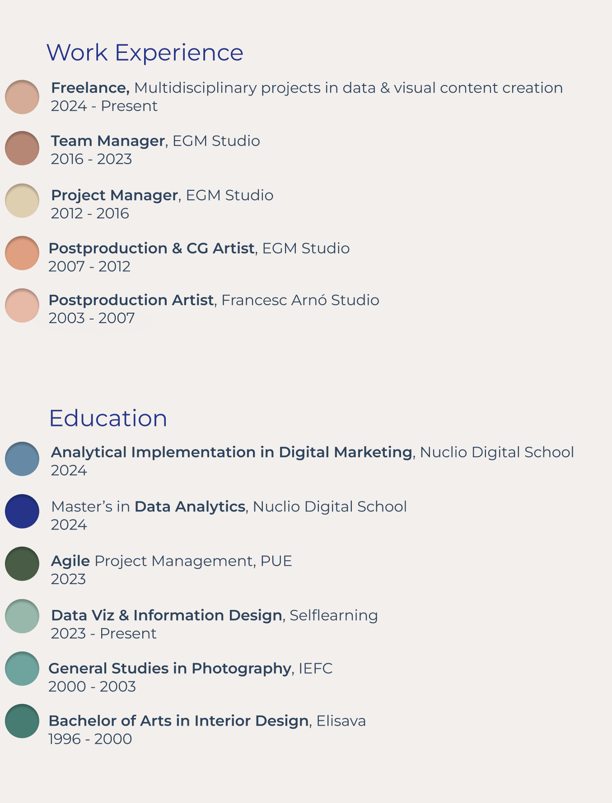
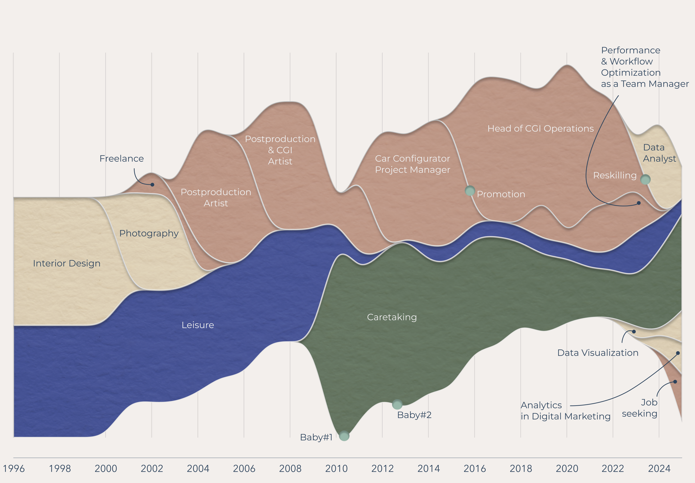
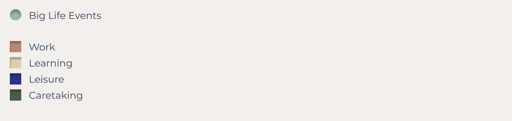

# Data Analyst

## I see data visualization as a form of functional art:
# turning complexity into visual narratives that connect data with people.

## Data Projects
**• Winner of the 30 days Women DataViz Challenge** The Women in DataViz 2025 Awards are an initiative of the ViT Foundation, a nonprofit organization committed to transparency, social innovation, and knowledge sharing through data visualization. The awards are part of the RETECH project, led by the Department of Business and Labour and the Secretariat for Digital Policies of the Catalan Government, and connected to other ViT initiatives such as the 30 Days Women Dataviz Challenge and the creation of open data and best practices repositories.    
[Click here to see the Challenge project on Observable](https://observablehq.com/d/c552448cb046fe91)  

**• Airbnb: Apartment Price Optimization in Madrid** Analysis of the nightly price of Airbnb apartments in Madrid to provide relevant insights and help the client maximize their returns. This study aims to better understand the variables influencing the price and offer recommendations based on the data obtained.    
[Click here to see Airbnb_Madrid project on GitHub](https://github.com/Laiacs/Portfolio/tree/main/Airbnb_Madrid)  

**• Health Analytics: Life Expectancy Analysis** An analysis of socioeconomic and public health factors influencing life expectancy at birth across different regions of the world, along with key recommendations to the World Health Organization (WHO) for improving global public health outcomes.  
[Click here to see Life_Expectancy project on GitHub](https://github.com/Laiacs/Portfolio/tree/main/Life_Expectancy)  

**• Lift&Lead: Analysis of Medals from the European Weightlifting Championship** Analysis of the medals won at the European Weightlifting Championship for 'Lift&Lead,' a fictional company planning to open CrossFit centers in Spain. The goal of this study is to provide key insights into athlete performance and assist in strategic decision-making for the company.  
[Click here to see Lift&Lead project on GitHub](https://github.com/Laiacs/Portfolio/tree/main/Lift_&_Lead)  

**• Chargeback Dashboard with LookerStudio** a dashboard for Amazon’s Chargebacks department, aimed at reducing their chargebacks for authenticated transactions by 5%.  
[Click here to see Chargeback_Dashboard_with_LookerStudio project on GitHub](https://github.com/Laiacs/Portfolio/tree/main/Chargeback_Dashboard_with_LookerStudio) 

**• My Resume** This circular timeline offers a visual journey through the evolution of my career and education. Warm colors represent key moments in my professional experience — from early jobs to leadership roles — while cool colors highlight educational milestones, from my academic foundations to recent reskilling efforts.

My professional path began in the creative industries, where I spent several years in digital postproduction and CGI. Over time, I moved into leadership positions, managing teams and client relationships, and gaining a deep understanding of project workflows and business dynamics. Key milestones include promotions to team manager, overseeing departmental budgets, and coordinating cross-functional projects. More recently, I’ve taken a strategic turn toward data, combining my visual expertise with analytical skills to explore new opportunities in data analytics, and digital marketing.

My educational background began in the arts and design, laying a solid foundation in visual communication and aesthetics. Throughout the years, I’ve continued to upskill — completing a Master’s in Data Analytics and specialized courses in Python, SQL, data visualization, digital analytics... This continuous learning reflects a commitment to evolving with the industry and aligning my skills with the growing demand for data-driven decision-making.  

**• How I spent my time** This timeline chart illustrates how I have allocated my time throughout the years, starting from my academic journey and moving through the different phases of my professional and personal life. Key milestones include the beginning of my career, promotions, becoming a parent, and more recently, my reskilling into data analytics. Each phase reflects shifts in priorities and the evolving balance between work, learning, and family life.  

## From team & project management to Data Analytics
After 7 years leading teams in the creative industry, I transitioned into data analytics, driven by my experience managing budgets and addressing financial discrepancies. Leveraging my background in design and photography, I specialize in creating impactful data visualizations. 

**I bring a cross-functional perspective that bridges design, business, and technology, acting as a link between stakeholders and data teams.**

## Skills  
SOFT  
**• Clear and empathetic communication**  
**• Commitment and attention to quality and detail**  
**• Critical and strategic thinking**  
**• Creativity and innovation**  
**• Adaptability and resilience**  
**• Confidentiality and discretion**  
**• Autonomy and continuous learning**  

HARD  
**• Interactive data visualization** (Observable, Plot, D3.js, JavaScript, HTML & CSS)  
**• Data Analysis and Statistics** (EDA)  
**• SQL and Databases** (MySQL and BigQuery)  
**• Python** (pandas, plotly, matplotlib, seaborn)  
**• Dashboards** (Power BI, Tableau, Looker, learning Flourish)  
**• KPI** Identification of Key Performance Indicators  
**• Google Analytics(GA4) & Google Tag Manager(GTM)**, basic implementation and reporting  
**• Machine Learning & AI** Basic understanding of supervised/unsupervised learning models and AI frameworks for data-driven solutions  
**• Figma, Photoshop, Illustrator, RawGraphs...** to create visuals and data storytelling presentations  
**• Project & Team Management:** Expertise in budgeting, strategic planning, workflow optimization  

## Languages  

**English**
Fluent  
**Spanish**
Native  
**Catalan**
Native

## Contact  
Barcelona, Spain  
laiacampoy@gmail.com  
[https://linkedin.com/in/laia-campoy](https://linkedin.com/in/laia-campoy)  
[https://github.com/Laiacs/Portfolio](https://github.com/Laiacs/Portfolio)  

