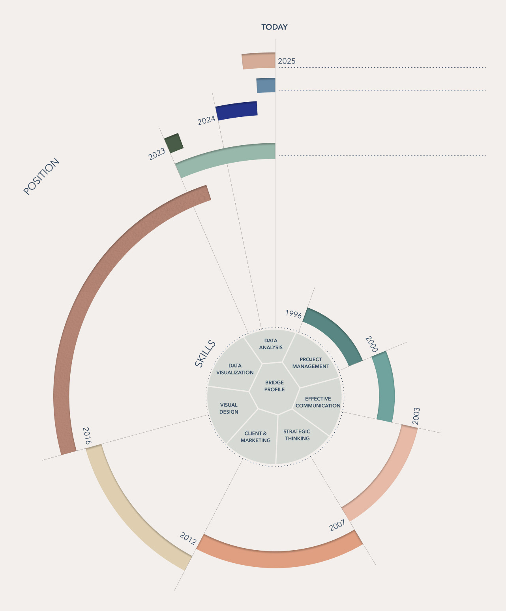

# I am a data visualization specialist based in Barcelona, blending strategic insights with clear and compelling visuals to drive effective storytelling.

## Projects

**Airbnb: Apartment Price Optimization in Madrid** Analysis of the nightly price of Airbnb apartments in Madrid to provide relevant insights and help the client maximize their returns. This study aims to better understand the variables influencing the price and offer recommendations based on the data obtained.    
[See Airbnb_Madrid project on GitHub](https://github.com/Laiacs/Portfolio/tree/main/Airbnb_Madrid)  

**Health Analytics: Life Expectancy Analysis** An analysis of socioeconomic and public health factors influencing life expectancy at birth across different regions of the world, along with key recommendations to the World Health Organization (WHO) for improving global public health outcomes.  
[See Life_Expectancy project on GitHub](https://github.com/Laiacs/Portfolio/tree/main/Life_Expectancy)  

**Lift&Lead: Analysis of Medals from the European Weightlifting Championship** Analysis of the medals won at the European Weightlifting Championship for 'Lift&Lead,' a fictional company planning to open CrossFit centers in Spain. The goal of this study is to provide key insights into athlete performance and assist in strategic decision-making for the company.  
[See Lift&Lead project on GitHub](https://github.com/Laiacs/Portfolio/tree/main/Lift_&_Lead)  

**Chargeback Dashboard with LookerStudio: Life Expectancy Analysis** a dashboard for Amazon’s Chargebacks department, aimed at reducing their chargebacks for authenticated transactions by 5%.  
[See Chargeback_Dashboard_with_LookerStudio project on GitHub](https://github.com/Laiacs/Portfolio/tree/main/Chargeback_Dashboard_with_LookerStudio)  

## From team and project management to Data Analytics
After 7 years leading teams in the creative industry, I transitioned into data analytics, driven by my experience managing budgets and addressing financial discrepancies. Leveraging my background in design and photography, I specialize in creating impactful data visualizations.  
During my Master’s in Data Analytics, I discovered how AI is making data science more accessible and have since focused on thoughtfully applying these technologies to create data-driven solutions.  
I am eager to put everything I’ve learned into practice and continue growing.

## Skills
**Data Analysis & Visualization:** Tableau, Looker Studio, Power BI, matplotlib, seaborn, RawGraphs.         
**Programming & Databases:** Python (pandas, NumPy), SQL, BigQuery.  
**Machine Learning & AI:** Basic understanding of supervised/unsupervised learning models and AI frameworks for data-driven solutions.   
**Analytical Tools:** Advanced Excel, Google Analytics.   
**Data Storytelling:** Clear and impactful visual design for stakeholders using tools like Photoshop, Illustrator, Cinema 4D, Canva, Figma and AI-powered solutions.  
**Project & Team Management:** Expertise in budgeting, recruiting, strategic planning, workflow optimization.

## Education
**2025 :: Minor in Analytical Implementation in Digital Marketing** Nuclio Digital School, Barcelona        
**2024 :: Master's in Data Analytics** Nuclio Digital School, Barcelona    
**2022 - 2023 :: Various Courses on Data Visualization and Information Design** – Domestika       
**2003 :: Degree in Photography** IEFC, Barcelona      
**2000 :: Bachelor of Arts with Honours in Interior Design** Elisava, *Barcelona* & Southampton University, *London*      

## Work Experience

**2016 - 2023 :: Team Manager at EGM Studio**
Responsible for leading a team of over 20 people at the creative studio specializing in CGI & post-production. Tasks included budgeting, recruiting personnel, and managing/monitoring projects.  
**2012 - 2016 :: SEAT & CUPRA’s Car Configurator Project Manager at EGM Studio**
Managed the production of the Car Configurator project for SEAT’s website, performing CGI and post-production tasks.  
**2007 - 2012 :: Postproduction & CG Artist at EGM Studio**
For a variety of studio clients, ranging from CUPRA & SEAT to Rosa Clará.  
**2004 - 2007 :: Postproduction Artist at Francesc Arnó Studio**
Specializing in advertising photography for fashion and products.  

## Languages  

**English**
Fluent  
**Spanish**
Native  
**Catalan**
Native

## Contact
Barcelona, Spain  
laiacampoy@gmail.com  
Linkedin: linkedin.com/in/laia-campoy  

