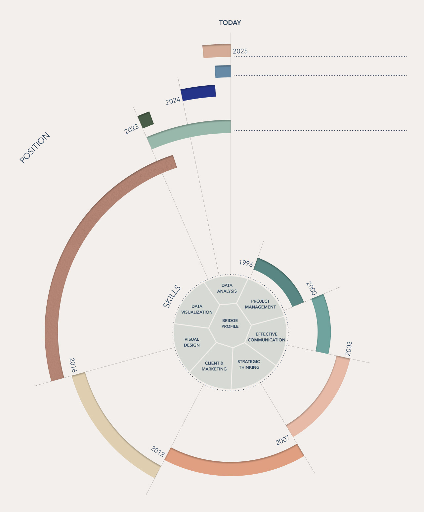
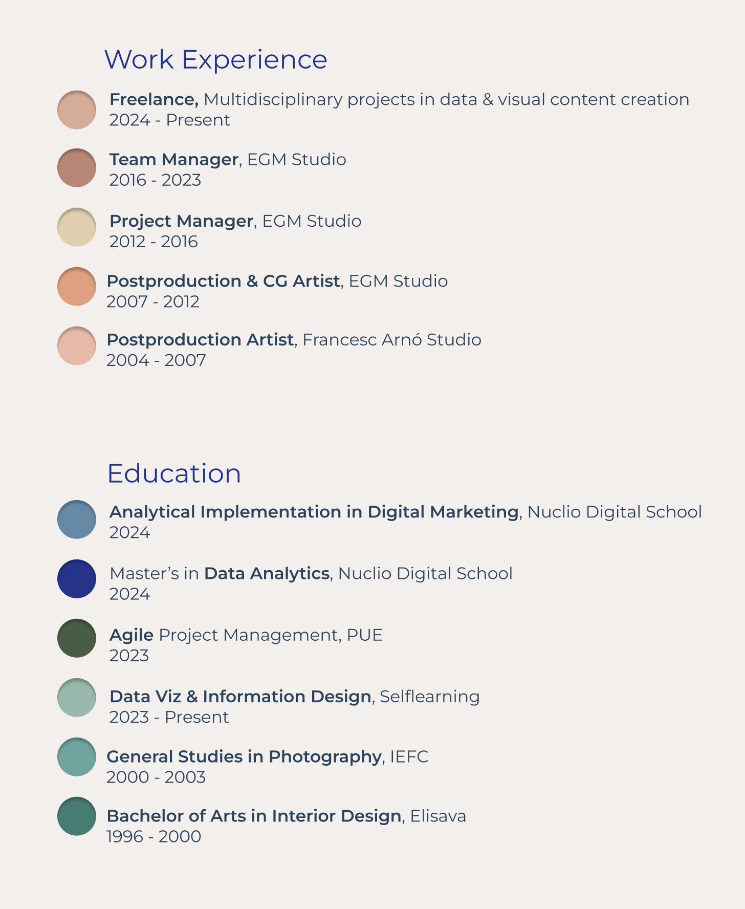
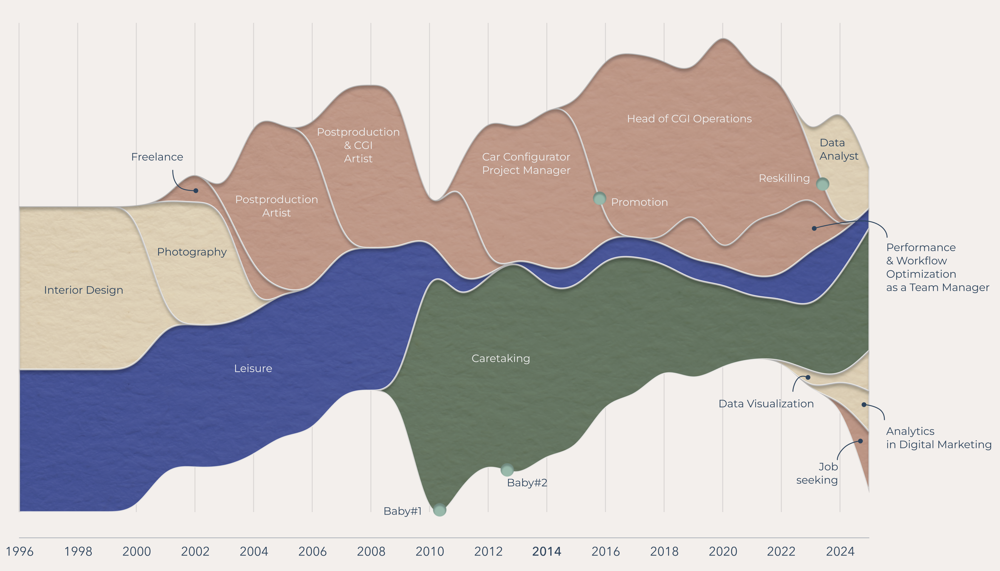

# Data Analyst

## I see data visualization as a form of functional art:
# turning complexity into visual narratives that connect data with people.

## Data Projects:

**Airbnb: Apartment Price Optimization in Madrid** Analysis of the nightly price of Airbnb apartments in Madrid to provide relevant insights and help the client maximize their returns. This study aims to better understand the variables influencing the price and offer recommendations based on the data obtained.    
[See Airbnb_Madrid project on GitHub](https://github.com/Laiacs/Portfolio/tree/main/Airbnb_Madrid)  

**Health Analytics: Life Expectancy Analysis** An analysis of socioeconomic and public health factors influencing life expectancy at birth across different regions of the world, along with key recommendations to the World Health Organization (WHO) for improving global public health outcomes.  
[See Life_Expectancy project on GitHub](https://github.com/Laiacs/Portfolio/tree/main/Life_Expectancy)  

**Lift&Lead: Analysis of Medals from the European Weightlifting Championship** Analysis of the medals won at the European Weightlifting Championship for 'Lift&Lead,' a fictional company planning to open CrossFit centers in Spain. The goal of this study is to provide key insights into athlete performance and assist in strategic decision-making for the company.  
[See Lift&Lead project on GitHub](https://github.com/Laiacs/Portfolio/tree/main/Lift_&_Lead)  

**Chargeback Dashboard with LookerStudio: Life Expectancy Analysis** a dashboard for Amazon’s Chargebacks department, aimed at reducing their chargebacks for authenticated transactions by 5%.  
[See Chargeback_Dashboard_with_LookerStudio project on GitHub](https://github.com/Laiacs/Portfolio/tree/main/Chargeback_Dashboard_with_LookerStudio) 

**My CV** Hot colors for my Experience and cold colors for my Education.

**How I spent my time** A graphic that explores how I spent my time since I starded studying.

## From team & project management to Data Analytics
After 7 years leading teams in the creative industry, I transitioned into data analytics, driven by my experience managing budgets and addressing financial discrepancies. Leveraging my background in design and photography, I specialize in creating impactful data visualizations. 

**I bring a cross-functional perspective that bridges design, business, and technology, acting as a link between stakeholders and data teams.**

## Skills:
**Data Analysis & Visualization:** Tableau, Looker Studio, Power BI, matplotlib, seaborn, RawGraphs.         
**Programming & Databases:** Python (pandas, NumPy), SQL, BigQuery.  
**Machine Learning & AI:** Basic understanding of supervised/unsupervised learning models and AI frameworks for data-driven solutions.   
**Analytical Tools:** Advanced Excel, Google Analytics.   
**Data Storytelling:** Clear and impactful visual design for stakeholders using tools like Photoshop, Illustrator, Cinema 4D, Canva, Figma and AI-powered solutions.  
**Project & Team Management:** Expertise in budgeting, recruiting, strategic planning, workflow optimization.

## Languages:  

**English**
Fluent  
**Spanish**
Native  
**Catalan**
Native

## Contact
Barcelona, Spain  
laiacampoy@gmail.com  
**[linkedin](linkedin.com/in/laia-campoy)**    
**[Github](https://github.com/Laiacs/Portfolio)**

